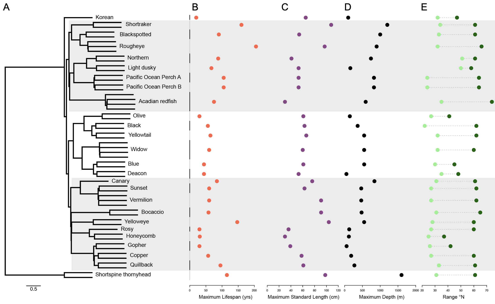

Here we will run cactus with softmasked assemblies and the tree that results from 02_TREES

Make our directory
```
mkdir -p /global/scratch/users/rdekayne/rockfish55/03_CACTUS && cd /global/scratch/users/rdekayne/rockfish55/03_CACTUS
```

Take our tree from astral:
```
(7164-PS-0008_quillback_2.fasta,(7164-PS-0008_quillback_1.fasta,((7164-PS-0001_copper_1.fasta,7164-PS-0001_copper_2.fasta)1:0.1424677260128401,((SebastescarnatusSEB-258_gopher_2.fasta,SebastescarnatusSEB-258_gopher_1.fasta)1:0.09039673212986797,(((Sebastesruberrimus12-Yellowye1a_2.fasta,Sebastesruberrimus12-Yellowye1a_1.fasta)1:0.770797464837357,(Sebastesrosaceus_rosy_kolora_1.fasta,(honeycomb-vgp_1.fasta,honeycomb-vgp_2.fasta)1:0.18366028287574962)1:0.6306503679745858)0.59:0.009454612874204363,((bocaccio-ccgp_1.fasta,bocaccio-ccgp_2.fasta)1:1.3712475322607418,((Sebastespinniger_canary_kolora_1.fasta,((SebastescrocotulusSEB-252_sunset_1.fasta,SebastescrocotulusSEB-252_sunset_2.fasta)1:0.03786332711616732,(SebastesminiatusSEB-256_vermilion_1.fasta,(SebastesminiatusSEB-256_vermilion_2.fasta,Sebastesminiatus_vermilion_kolora_1.fasta)0.34:3.879431340483007E-5)0.84:0.018634990946743476)1:0.6312181279928225)1:0.34108188047804483,((((SebastesserranoidesSEB-259_olive_1.fasta,SebastesserranoidesSEB-259_olive_2.fasta)1:0.645392690221368,((7164-PS-0002_black_1.fasta,7164-PS-0002_black_2.fasta)1:0.14253794180479365,(7164-PS-0005_yellowtail_2.fasta,7164-PS-0005_yellowtail_1.fasta)1:0.157886801323379)1:0.2783143507098061)1:0.3793218857301372,((7164-PS-0004_widow_2.fasta,(widow-ccgp_2.fasta,(widow-ccgp_1.fasta,7164-PS-0004_widow_1.fasta)0.56:0.010841239959272457)0.44:0.004639171801147916)1:0.6155177189166579,((SebastesmystinusSEB-254_blue_2.fasta,SebastesmystinusSEB-254_blue_1.fasta)1:0.12256970202153568,(m84185_240412_222911_s4_deacon_2.fasta,m84185_240412_222911_s4_deacon_1.fasta)1:0.12357563396094631)1:0.40349759242682914)1:0.3119570693947658)1:0.17244761710045392,((korean_1.fasta,(SebastesalascanusSEB-2_shortspinethornyhead_1.fasta,SebastesalascanusSEB-2_shortspinethornyhead_2.fasta)1:4.198415671477981)1:0.07496658560371545,(((SebastesborealisSEB-8_shortraker_1.fasta,SebastesborealisSEB-8_shortraker_2.fasta)1:0.7724857134310612,((SebastesmelanostictusSEB-4_blackspotted_2.fasta,SebastesmelanostictusSEB-4_blackspotted_1.fasta)1:0.21873808985023532,(Sebastesaleutianus_rougheye_kolora_1.fasta,(7164-PS-0003_rougheye_2.fasta,7164-PS-0003_rougheye_1.fasta)0.7:0.013538466385956963)1:0.2756801626705779)1:0.30026750581185935)1:0.09207321490500221,((((SebastespolyspinisSEB-5_northern_1.fasta,SebastespolyspinisSEB-5_northern_2.fasta)1:0.34563479768815103,(7164-PS-0007_lightdusky_1.fasta,7164-PS-0007_lightdusky_2.fasta)1:0.3527623240520237)1:0.4516959203113194,((SebastesalutusPOP6_popa_1.fasta,SebastesalutusPOP6_popa_2.fasta)0.84:0.019756392581229142,(7164-PS-0006_popb_1.fasta,7164-PS-0006_popb_2.fasta)0.99:0.034093999074071214)1:0.717186113971784)1:0.150328731402828,(acadian-vgp_2.fasta,((acadian-cbp_2.fasta,acadian-vgp_1.fasta)0.63:0.01057928775288701,acadian-cbp_1.fasta)1:0.0505594435457738)1:1.272581994326498)0.91:0.02253947124142529)1:0.08981660529081917)1:0.07187178539107916)1:0.0806108699606159)0.68:0.014855815381094721)0.46:0.005636934748482787)1:0.7944007832631872)0.8:0.021212719130486536)1:0.143176204937087));
```

Now make some changes to re-root tree around thornyhead and haplotype resolved individuals renamed to have .1/.2 suffix

We also also fix the quillback.2 branchlength which was arbitrarily set as root during astral run and had mistake in branchlength once tree was rerooted (set back to 1.0)

```
((korean:1.0,((((SebastesborealisSEB-8_shortraker.1:1.0,SebastesborealisSEB-8_shortraker.2:1.0):0.7724857134310614,((SebastesmelanostictusSEB-4_blackspotted.2:1.0,SebastesmelanostictusSEB-4_blackspotted.1:1.0):0.2187380898502358,(Sebastesaleutianus_rougheye_kolora:0.9999999999999996,(7164-PS-0003_rougheye.2:1.0000000000000004,7164-PS-0003_rougheye.1:1.0000000000000004):0.013538466385956127):0.2756801626705787):0.3002675058118589):0.09207321490500231,((((SebastespolyspinisSEB-5_northern.1:1.0,SebastespolyspinisSEB-5_northern.2:1.0):0.34563479768815153,(7164-PS-0007_lightdusky.1:1.0,7164-PS-0007_lightdusky.2:1.0):0.35276232405202457):0.45169592031131955,((SebastesalutusPOP6_popa.1:1.0,SebastesalutusPOP6_popa.2:1.0):0.019756392581228965,(7164-PS-0006_popb.1:1.0,7164-PS-0006_popb.2:1.0):0.03409399907407096):0.7171861139717848):0.1503287314028281,(acadian-vgp.2:1.0,((acadian-cbp.2:1.0000000000000004,acadian-vgp.1:1.0000000000000004):0.01057928775288719,acadian-cbp.1:0.9999999999999996):0.050559443545773686):1.2725819943264982):0.022539471241424636):0.08981660529081914,((((SebastesserranoidesSEB-259_olive.1:1.0,SebastesserranoidesSEB-259_olive.2:1.0):0.6453926902213682,((7164-PS-0002_black.1:1.0,7164-PS-0002_black.2:1.0):0.14253794180479407,(7164-PS-0005_yellowtail.2:1.0,7164-PS-0005_yellowtail.1:1.0):0.15788680132337962):0.27831435070980604):0.37932188573013725,((7164-PS-0004_widow.2:1.0,(widow-ccgp.2:1.0,(widow-ccgp.1:1.0,7164-PS-0004_widow.1:1.0):0.010841239959272997):0.00463917180114759):0.6155177189166574,((SebastesmystinusSEB-254_blue.2:1.0,SebastesmystinusSEB-254_blue.1:1.0):0.12256970202153461,(m84185_240412_222911_s4_deacon.2:1.0,m84185_240412_222911_s4_deacon.1:1.0):0.12357563396094573):0.40349759242682914):0.31195706939476686):0.17244761710045342,((Sebastespinniger_canary_kolora:1.0,((SebastescrocotulusSEB-252_sunset.1:0.9999999999999996,SebastescrocotulusSEB-252_sunset.2:0.9999999999999996):0.03786332711616769,(SebastesminiatusSEB-256_vermilion.1:1.0000000000000004,(SebastesminiatusSEB-256_vermilion.2:1.0,Sebastesminiatus_vermilion_kolora:1.0):3.8794313405254854E-5):0.018634990946742924):0.6312181279928231):0.3410818804780442,((bocaccio-ccgp.1:1.0,bocaccio-ccgp.2:1.0):1.3712475322607416,(((Sebastesruberrimus12-Yellowye1a.2:1.0,Sebastesruberrimus12-Yellowye1a.1:1.0):0.770797464837357,(Sebastesrosaceus_rosy_kolora:1.0,(honeycomb-vgp.1:0.9999999999999996,honeycomb-vgp.2:0.9999999999999996):0.1836602828757501):0.6306503679745861):0.009454612874204571,((SebastescarnatusSEB-258_gopher.2:1.0,SebastescarnatusSEB-258_gopher.1:1.0):0.09039673212986798,((7164-PS-0001_copper.1:1.0,7164-PS-0001_copper.2:1.0):0.14246772601283997,(7164-PS-0008_quillback.1:1.0,7164-PS-0008_quillback.2:1.0):0.14317620493708727):0.021212719130486057):0.7944007832631872):0.005636934748483036):0.014855815381094928):0.08061086996061562):0.07187178539107908):0.07496658560371561):2.0992078357389903,(SebastesalascanusSEB-2_shortspinethornyhead.1:1.0,SebastesalascanusSEB-2_shortspinethornyhead.2:1.0):2.0992078357389903);
```

The list of individuals to include in our cactus alignment `cactus_indivs.txt`
```
7164-PS-0001_copper.1
7164-PS-0001_copper.2
7164-PS-0002_black.1
7164-PS-0002_black.2
7164-PS-0003_rougheye.1
7164-PS-0003_rougheye.2
7164-PS-0004_widow.1
7164-PS-0004_widow.2
7164-PS-0005_yellowtail.1
7164-PS-0005_yellowtail.2
7164-PS-0006_popb.1
7164-PS-0006_popb.2
7164-PS-0007_lightdusky.1
7164-PS-0007_lightdusky.2
7164-PS-0008_quillback.1
7164-PS-0008_quillback.2
acadian-cbp.1
acadian-cbp.2
acadian-vgp.1
acadian-vgp.2
bocaccio-ccgp.1
bocaccio-ccgp.2
honeycomb-vgp.1
honeycomb-vgp.2
korean
m84185_240412_222911_s4_deacon.1
m84185_240412_222911_s4_deacon.2
SebastesalascanusSEB-2_shortspinethornyhead.1
SebastesalascanusSEB-2_shortspinethornyhead.2
Sebastesaleutianus_rougheye_kolora
SebastesalutusPOP6_popa.1
SebastesalutusPOP6_popa.2
SebastesborealisSEB-8_shortraker.1
SebastesborealisSEB-8_shortraker.2
SebastescarnatusSEB-258_gopher.1
SebastescarnatusSEB-258_gopher.2
SebastescrocotulusSEB-252_sunset.1
SebastescrocotulusSEB-252_sunset.2
SebastesmelanostictusSEB-4_blackspotted.1
SebastesmelanostictusSEB-4_blackspotted.2
SebastesminiatusSEB-256_vermilion.1
SebastesminiatusSEB-256_vermilion.2
Sebastesminiatus_vermilion_kolora
SebastesmystinusSEB-254_blue.1
SebastesmystinusSEB-254_blue.2
Sebastespinniger_canary_kolora
SebastespolyspinisSEB-5_northern.1
SebastespolyspinisSEB-5_northern.2
Sebastesrosaceus_rosy_kolora
Sebastesruberrimus12-Yellowye1a.1
Sebastesruberrimus12-Yellowye1a.2
SebastesserranoidesSEB-259_olive.1
SebastesserranoidesSEB-259_olive.2
widow-ccgp.1
widow-ccgp.2
```

Get the filepaths to corresponding individuals `cactus_filepaths.txt`
```
 /global/scratch/users/rdekayne/rockfish55/assemblies/7164-PS-0001_copper_1.fasta
 /global/scratch/users/rdekayne/rockfish55/assemblies/7164-PS-0001_copper_2.fasta
 /global/scratch/users/rdekayne/rockfish55/assemblies/7164-PS-0002_black_1.fasta
 /global/scratch/users/rdekayne/rockfish55/assemblies/7164-PS-0002_black_2.fasta
 /global/scratch/users/rdekayne/rockfish55/assemblies/7164-PS-0003_rougheye_1.fasta
 /global/scratch/users/rdekayne/rockfish55/assemblies/7164-PS-0003_rougheye_2.fasta
 /global/scratch/users/rdekayne/rockfish55/assemblies/7164-PS-0004_widow_1.fasta
 /global/scratch/users/rdekayne/rockfish55/assemblies/7164-PS-0004_widow_2.fasta
 /global/scratch/users/rdekayne/rockfish55/assemblies/7164-PS-0005_yellowtail_1.fasta
 /global/scratch/users/rdekayne/rockfish55/assemblies/7164-PS-0005_yellowtail_2.fasta
 /global/scratch/users/rdekayne/rockfish55/assemblies/7164-PS-0006_popb_1.fasta
 /global/scratch/users/rdekayne/rockfish55/assemblies/7164-PS-0006_popb_2.fasta
 /global/scratch/users/rdekayne/rockfish55/assemblies/7164-PS-0007_lightdusky_1.fasta
 /global/scratch/users/rdekayne/rockfish55/assemblies/7164-PS-0007_lightdusky_2.fasta
 /global/scratch/users/rdekayne/rockfish55/assemblies/7164-PS-0008_quillback_1.fasta
 /global/scratch/users/rdekayne/rockfish55/assemblies/7164-PS-0008_quillback_2.fasta
 /global/scratch/users/rdekayne/rockfish55/assemblies/acadian-cbp_1.fasta
 /global/scratch/users/rdekayne/rockfish55/assemblies/acadian-cbp_2.fasta
 /global/scratch/users/rdekayne/rockfish55/assemblies/acadian-vgp_1.fasta
 /global/scratch/users/rdekayne/rockfish55/assemblies/acadian-vgp_2.fasta
 /global/scratch/users/rdekayne/rockfish55/assemblies/bocaccio-ccgp_1.fasta
 /global/scratch/users/rdekayne/rockfish55/assemblies/bocaccio-ccgp_2.fasta
 /global/scratch/users/rdekayne/rockfish55/assemblies/honeycomb-vgp_1.fasta
 /global/scratch/users/rdekayne/rockfish55/assemblies/honeycomb-vgp_2.fasta
 /global/scratch/users/rdekayne/rockfish55/assemblies/korean_1.fasta
 /global/scratch/users/rdekayne/rockfish55/assemblies/m84185_240412_222911_s4_deacon_1.fasta
 /global/scratch/users/rdekayne/rockfish55/assemblies/m84185_240412_222911_s4_deacon_2.fasta
 /global/scratch/users/rdekayne/rockfish55/assemblies/SebastesalascanusSEB-2_shortspinethornyhead_1.fasta
 /global/scratch/users/rdekayne/rockfish55/assemblies/SebastesalascanusSEB-2_shortspinethornyhead_2.fasta
 /global/scratch/users/rdekayne/rockfish55/assemblies/Sebastesaleutianus_rougheye_kolora_1.fasta
 /global/scratch/users/rdekayne/rockfish55/assemblies/SebastesalutusPOP6_popa_1.fasta
 /global/scratch/users/rdekayne/rockfish55/assemblies/SebastesalutusPOP6_popa_2.fasta
 /global/scratch/users/rdekayne/rockfish55/assemblies/SebastesborealisSEB-8_shortraker_1.fasta
 /global/scratch/users/rdekayne/rockfish55/assemblies/SebastesborealisSEB-8_shortraker_2.fasta
 /global/scratch/users/rdekayne/rockfish55/assemblies/SebastescarnatusSEB-258_gopher_1.fasta
 /global/scratch/users/rdekayne/rockfish55/assemblies/SebastescarnatusSEB-258_gopher_2.fasta
 /global/scratch/users/rdekayne/rockfish55/assemblies/SebastescrocotulusSEB-252_sunset_1.fasta
 /global/scratch/users/rdekayne/rockfish55/assemblies/SebastescrocotulusSEB-252_sunset_2.fasta
 /global/scratch/users/rdekayne/rockfish55/assemblies/SebastesmelanostictusSEB-4_blackspotted_1.fasta
 /global/scratch/users/rdekayne/rockfish55/assemblies/SebastesmelanostictusSEB-4_blackspotted_2.fasta
 /global/scratch/users/rdekayne/rockfish55/assemblies/SebastesminiatusSEB-256_vermilion_1.fasta
 /global/scratch/users/rdekayne/rockfish55/assemblies/SebastesminiatusSEB-256_vermilion_2.fasta
 /global/scratch/users/rdekayne/rockfish55/assemblies/Sebastesminiatus_vermilion_kolora_1.fasta
 /global/scratch/users/rdekayne/rockfish55/assemblies/SebastesmystinusSEB-254_blue_1.fasta
 /global/scratch/users/rdekayne/rockfish55/assemblies/SebastesmystinusSEB-254_blue_2.fasta
 /global/scratch/users/rdekayne/rockfish55/assemblies/Sebastespinniger_canary_kolora_1.fasta
 /global/scratch/users/rdekayne/rockfish55/assemblies/SebastespolyspinisSEB-5_northern_1.fasta
 /global/scratch/users/rdekayne/rockfish55/assemblies/SebastespolyspinisSEB-5_northern_2.fasta
 /global/scratch/users/rdekayne/rockfish55/assemblies/Sebastesrosaceus_rosy_kolora_1.fasta
 /global/scratch/users/rdekayne/rockfish55/assemblies/Sebastesruberrimus12-Yellowye1a_1.fasta
 /global/scratch/users/rdekayne/rockfish55/assemblies/Sebastesruberrimus12-Yellowye1a_2.fasta
 /global/scratch/users/rdekayne/rockfish55/assemblies/SebastesserranoidesSEB-259_olive_1.fasta
 /global/scratch/users/rdekayne/rockfish55/assemblies/SebastesserranoidesSEB-259_olive_2.fasta
 /global/scratch/users/rdekayne/rockfish55/assemblies/widow-ccgp_1.fasta
 /global/scratch/users/rdekayne/rockfish55/assemblies/widow-ccgp_2.fasta
```

Now comebine them as cactus input
```
paste cactus_indivs.txt cactus_filepaths.txt > cactus_bottom_file.txt
cp cactus_bottom_file.txt cactus_input_55rockfish.txt
```

We then add the tree to the top of this file

Our full cactus input file `cactus_input_55rockfish.txt` is as follows:
```
((korean:1.0,((((SebastesborealisSEB-8_shortraker.1:1.0,SebastesborealisSEB-8_shortraker.2:1.0):0.7724857134310614,((SebastesmelanostictusSEB-4_blackspotted.2:1.0,SebastesmelanostictusSEB-4_blackspotted.1:1.0):0.2187380898502358,(Sebastesaleutianus_rougheye_kolora:0.9999999999999996,(7164-PS-0003_rougheye.2:1.0000000000000004,7164-PS-0003_rougheye.1:1.0000000000000004):0.013538466385956127):0.2756801626705787):0.3002675058118589):0.09207321490500231,((((SebastespolyspinisSEB-5_northern.1:1.0,SebastespolyspinisSEB-5_northern.2:1.0):0.34563479768815153,(7164-PS-0007_lightdusky.1:1.0,7164-PS-0007_lightdusky.2:1.0):0.35276232405202457):0.45169592031131955,((SebastesalutusPOP6_popa.1:1.0,SebastesalutusPOP6_popa.2:1.0):0.019756392581228965,(7164-PS-0006_popb.1:1.0,7164-PS-0006_popb.2:1.0):0.03409399907407096):0.7171861139717848):0.1503287314028281,(acadian-vgp.2:1.0,((acadian-cbp.2:1.0000000000000004,acadian-vgp.1:1.0000000000000004):0.01057928775288719,acadian-cbp.1:0.9999999999999996):0.050559443545773686):1.2725819943264982):0.022539471241424636):0.08981660529081914,((((SebastesserranoidesSEB-259_olive.1:1.0,SebastesserranoidesSEB-259_olive.2:1.0):0.6453926902213682,((7164-PS-0002_black.1:1.0,7164-PS-0002_black.2:1.0):0.14253794180479407,(7164-PS-0005_yellowtail.2:1.0,7164-PS-0005_yellowtail.1:1.0):0.15788680132337962):0.27831435070980604):0.37932188573013725,((7164-PS-0004_widow.2:1.0,(widow-ccgp.2:1.0,(widow-ccgp.1:1.0,7164-PS-0004_widow.1:1.0):0.010841239959272997):0.00463917180114759):0.6155177189166574,((SebastesmystinusSEB-254_blue.2:1.0,SebastesmystinusSEB-254_blue.1:1.0):0.12256970202153461,(m84185_240412_222911_s4_deacon.2:1.0,m84185_240412_222911_s4_deacon.1:1.0):0.12357563396094573):0.40349759242682914):0.31195706939476686):0.17244761710045342,((Sebastespinniger_canary_kolora:1.0,((SebastescrocotulusSEB-252_sunset.1:0.9999999999999996,SebastescrocotulusSEB-252_sunset.2:0.9999999999999996):0.03786332711616769,(SebastesminiatusSEB-256_vermilion.1:1.0000000000000004,(SebastesminiatusSEB-256_vermilion.2:1.0,Sebastesminiatus_vermilion_kolora:1.0):3.8794313405254854E-5):0.018634990946742924):0.6312181279928231):0.3410818804780442,((bocaccio-ccgp.1:1.0,bocaccio-ccgp.2:1.0):1.3712475322607416,(((Sebastesruberrimus12-Yellowye1a.2:1.0,Sebastesruberrimus12-Yellowye1a.1:1.0):0.770797464837357,(Sebastesrosaceus_rosy_kolora:1.0,(honeycomb-vgp.1:0.9999999999999996,honeycomb-vgp.2:0.9999999999999996):0.1836602828757501):0.6306503679745861):0.009454612874204571,((SebastescarnatusSEB-258_gopher.2:1.0,SebastescarnatusSEB-258_gopher.1:1.0):0.09039673212986798,((7164-PS-0001_copper.1:1.0,7164-PS-0001_copper.2:1.0):0.14246772601283997,(7164-PS-0008_quillback.1:1.0,7164-PS-0008_quillback.2:1.0):0.14317620493708727):0.021212719130486057):0.7944007832631872):0.005636934748483036):0.014855815381094928):0.08061086996061562):0.07187178539107908):0.07496658560371561):2.0992078357389903,(SebastesalascanusSEB-2_shortspinethornyhead.1:1.0,SebastesalascanusSEB-2_shortspinethornyhead.2:1.0):2.0992078357389903);

7164-PS-0001_copper.1	 /global/scratch/users/rdekayne/rockfish55/assemblies/7164-PS-0001_copper_1.fasta
7164-PS-0001_copper.2	 /global/scratch/users/rdekayne/rockfish55/assemblies/7164-PS-0001_copper_2.fasta
7164-PS-0002_black.1	 /global/scratch/users/rdekayne/rockfish55/assemblies/7164-PS-0002_black_1.fasta
7164-PS-0002_black.2	 /global/scratch/users/rdekayne/rockfish55/assemblies/7164-PS-0002_black_2.fasta
7164-PS-0003_rougheye.1	 /global/scratch/users/rdekayne/rockfish55/assemblies/7164-PS-0003_rougheye_1.fasta
7164-PS-0003_rougheye.2	 /global/scratch/users/rdekayne/rockfish55/assemblies/7164-PS-0003_rougheye_2.fasta
7164-PS-0004_widow.1	 /global/scratch/users/rdekayne/rockfish55/assemblies/7164-PS-0004_widow_1.fasta
7164-PS-0004_widow.2	 /global/scratch/users/rdekayne/rockfish55/assemblies/7164-PS-0004_widow_2.fasta
7164-PS-0005_yellowtail.1	 /global/scratch/users/rdekayne/rockfish55/assemblies/7164-PS-0005_yellowtail_1.fasta
7164-PS-0005_yellowtail.2	 /global/scratch/users/rdekayne/rockfish55/assemblies/7164-PS-0005_yellowtail_2.fasta
7164-PS-0006_popb.1	 /global/scratch/users/rdekayne/rockfish55/assemblies/7164-PS-0006_popb_1.fasta
7164-PS-0006_popb.2	 /global/scratch/users/rdekayne/rockfish55/assemblies/7164-PS-0006_popb_2.fasta
7164-PS-0007_lightdusky.1	 /global/scratch/users/rdekayne/rockfish55/assemblies/7164-PS-0007_lightdusky_1.fasta
7164-PS-0007_lightdusky.2	 /global/scratch/users/rdekayne/rockfish55/assemblies/7164-PS-0007_lightdusky_2.fasta
7164-PS-0008_quillback.1	 /global/scratch/users/rdekayne/rockfish55/assemblies/7164-PS-0008_quillback_1.fasta
7164-PS-0008_quillback.2	 /global/scratch/users/rdekayne/rockfish55/assemblies/7164-PS-0008_quillback_2.fasta
acadian-cbp.1	 /global/scratch/users/rdekayne/rockfish55/assemblies/acadian-cbp_1.fasta
acadian-cbp.2	 /global/scratch/users/rdekayne/rockfish55/assemblies/acadian-cbp_2.fasta
acadian-vgp.1	 /global/scratch/users/rdekayne/rockfish55/assemblies/acadian-vgp_1.fasta
acadian-vgp.2	 /global/scratch/users/rdekayne/rockfish55/assemblies/acadian-vgp_2.fasta
bocaccio-ccgp.1	 /global/scratch/users/rdekayne/rockfish55/assemblies/bocaccio-ccgp_1.fasta
bocaccio-ccgp.2	 /global/scratch/users/rdekayne/rockfish55/assemblies/bocaccio-ccgp_2.fasta
honeycomb-vgp.1	 /global/scratch/users/rdekayne/rockfish55/assemblies/honeycomb-vgp_1.fasta
honeycomb-vgp.2	 /global/scratch/users/rdekayne/rockfish55/assemblies/honeycomb-vgp_2.fasta
korean	 /global/scratch/users/rdekayne/rockfish55/assemblies/korean_1.fasta
m84185_240412_222911_s4_deacon.1	 /global/scratch/users/rdekayne/rockfish55/assemblies/m84185_240412_222911_s4_deacon_1.fasta
m84185_240412_222911_s4_deacon.2	 /global/scratch/users/rdekayne/rockfish55/assemblies/m84185_240412_222911_s4_deacon_2.fasta
SebastesalascanusSEB-2_shortspinethornyhead.1	 /global/scratch/users/rdekayne/rockfish55/assemblies/SebastesalascanusSEB-2_shortspinethornyhead_1.fasta
SebastesalascanusSEB-2_shortspinethornyhead.2	 /global/scratch/users/rdekayne/rockfish55/assemblies/SebastesalascanusSEB-2_shortspinethornyhead_2.fasta
Sebastesaleutianus_rougheye_kolora	 /global/scratch/users/rdekayne/rockfish55/assemblies/Sebastesaleutianus_rougheye_kolora_1.fasta
SebastesalutusPOP6_popa.1	 /global/scratch/users/rdekayne/rockfish55/assemblies/SebastesalutusPOP6_popa_1.fasta
SebastesalutusPOP6_popa.2	 /global/scratch/users/rdekayne/rockfish55/assemblies/SebastesalutusPOP6_popa_2.fasta
SebastesborealisSEB-8_shortraker.1	 /global/scratch/users/rdekayne/rockfish55/assemblies/SebastesborealisSEB-8_shortraker_1.fasta
SebastesborealisSEB-8_shortraker.2	 /global/scratch/users/rdekayne/rockfish55/assemblies/SebastesborealisSEB-8_shortraker_2.fasta
SebastescarnatusSEB-258_gopher.1	 /global/scratch/users/rdekayne/rockfish55/assemblies/SebastescarnatusSEB-258_gopher_1.fasta
SebastescarnatusSEB-258_gopher.2	 /global/scratch/users/rdekayne/rockfish55/assemblies/SebastescarnatusSEB-258_gopher_2.fasta
SebastescrocotulusSEB-252_sunset.1	 /global/scratch/users/rdekayne/rockfish55/assemblies/SebastescrocotulusSEB-252_sunset_1.fasta
SebastescrocotulusSEB-252_sunset.2	 /global/scratch/users/rdekayne/rockfish55/assemblies/SebastescrocotulusSEB-252_sunset_2.fasta
SebastesmelanostictusSEB-4_blackspotted.1	 /global/scratch/users/rdekayne/rockfish55/assemblies/SebastesmelanostictusSEB-4_blackspotted_1.fasta
SebastesmelanostictusSEB-4_blackspotted.2	 /global/scratch/users/rdekayne/rockfish55/assemblies/SebastesmelanostictusSEB-4_blackspotted_2.fasta
SebastesminiatusSEB-256_vermilion.1	 /global/scratch/users/rdekayne/rockfish55/assemblies/SebastesminiatusSEB-256_vermilion_1.fasta
SebastesminiatusSEB-256_vermilion.2	 /global/scratch/users/rdekayne/rockfish55/assemblies/SebastesminiatusSEB-256_vermilion_2.fasta
Sebastesminiatus_vermilion_kolora	 /global/scratch/users/rdekayne/rockfish55/assemblies/Sebastesminiatus_vermilion_kolora_1.fasta
SebastesmystinusSEB-254_blue.1	 /global/scratch/users/rdekayne/rockfish55/assemblies/SebastesmystinusSEB-254_blue_1.fasta
SebastesmystinusSEB-254_blue.2	 /global/scratch/users/rdekayne/rockfish55/assemblies/SebastesmystinusSEB-254_blue_2.fasta
Sebastespinniger_canary_kolora	 /global/scratch/users/rdekayne/rockfish55/assemblies/Sebastespinniger_canary_kolora_1.fasta
SebastespolyspinisSEB-5_northern.1	 /global/scratch/users/rdekayne/rockfish55/assemblies/SebastespolyspinisSEB-5_northern_1.fasta
SebastespolyspinisSEB-5_northern.2	 /global/scratch/users/rdekayne/rockfish55/assemblies/SebastespolyspinisSEB-5_northern_2.fasta
Sebastesrosaceus_rosy_kolora	 /global/scratch/users/rdekayne/rockfish55/assemblies/Sebastesrosaceus_rosy_kolora_1.fasta
Sebastesruberrimus12-Yellowye1a.1	 /global/scratch/users/rdekayne/rockfish55/assemblies/Sebastesruberrimus12-Yellowye1a_1.fasta
Sebastesruberrimus12-Yellowye1a.2	 /global/scratch/users/rdekayne/rockfish55/assemblies/Sebastesruberrimus12-Yellowye1a_2.fasta
SebastesserranoidesSEB-259_olive.1	 /global/scratch/users/rdekayne/rockfish55/assemblies/SebastesserranoidesSEB-259_olive_1.fasta
SebastesserranoidesSEB-259_olive.2	 /global/scratch/users/rdekayne/rockfish55/assemblies/SebastesserranoidesSEB-259_olive_2.fasta
widow-ccgp.1	 /global/scratch/users/rdekayne/rockfish55/assemblies/widow-ccgp_1.fasta
widow-ccgp.2	 /global/scratch/users/rdekayne/rockfish55/assemblies/widow-ccgp_2.fasta
```

Then we prepare the environment

```
cd /global/scratch/users/rdekayne/rockfish/03_CACTUS/cactus
source cactus_env/bin/activate
cd /global/scratch/users/rdekayne/rockfish55/03_CACTUS
```

And run cactus with `run55cactus.sh`
```
#!/bin/bash
#SBATCH --job-name=cactus_50
#SBATCH --time=7-00:00:00 # Wall clock time limit in Days-Hours:min:seconds
#SBATCH --account=co_genomicdata
#SBATCH --partition=savio4_htc
#SBATCH --qos=genomicdata_htc4_normal
#SBATCH --output=cactus_test%j.out # output file
#SBATCH --error=cactus_test%j.err # error file
#SBATCH --ntasks=1 # Run 1 job
#SBATCH --ntasks-per-node=1 # One task per computer
#SBATCH --cpus-per-task=56 # 2 CPUs per job

singularity exec ../../rockfish/03_CACTUS/cactus_v2.9.3.sif cactus ./js ./cactus_input_55rockfish.txt ./55_rockfish.hal
```
`sbatch run55cactus.sh`

Check the output with `run_halval_and_halstat.sh`
```

#!/bin/bash
#SBATCH --job-name=cactus_val_stat
#SBATCH --time=0-24:00:00 # Wall clock time limit in Days-Hours:min:seconds
#SBATCH --account=co_genomicdata
#SBATCH --partition=savio4_htc
#SBATCH --output=cactus_test%j.out # output file
#SBATCH --error=cactus_test%j.err # error file
#SBATCH --ntasks=1 # Run 1 job
#SBATCH --ntasks-per-node=1 # One task per computer
#SBATCH --cpus-per-task=24 # 2 CPUs per job

singularity exec ../../rockfish/03_CACTUS/cactus_v2.9.3.sif halValidate ./55_rockfish.hal
singularity exec ../../rockfish/03_CACTUS/cactus_v2.9.3.sif halStats ./55_rockfish.hal
```
and submit as follows `sbatch run_halval_and_halstat.sh`

Produces this output
```
hal v2.2
((korean:1,((((SebastesborealisSEB-8_shortraker.1:1,SebastesborealisSEB-8_shortraker.2:1)Anc10:0.772486,((SebastesmelanostictusSEB-4_blackspotted.2:1,SebastesmelanostictusSEB-4_blackspotted.1:1)Anc18:0.218738,(Sebastesaleutianus_rougheye_kolora:1,(7164-PS-0003_rougheye.2:1,7164-PS-0003_rougheye.1:1)Anc30:0.0135385)Anc19:0.27568)Anc11:0.300268)Anc06:0.0920732,((((SebastespolyspinisSEB-5_northern.1:1,SebastespolyspinisSEB-5_northern.2:1)Anc31:0.345635,(7164-PS-0007_lightdusky.1:1,7164-PS-0007_lightdusky.2:1)Anc32:0.352762)Anc20:0.451696,((SebastesalutusPOP6_popa.1:1,SebastesalutusPOP6_popa.2:1)Anc33:0.0197564,(7164-PS-0006_popb.1:1,7164-PS-0006_popb.2:1)Anc34:0.034094)Anc21:0.717186)Anc12:0.150329,(acadian-vgp.2:1,((acadian-cbp.2:1,acadian-vgp.1:1)Anc35:0.0105793,acadian-cbp.1:1)Anc22:0.0505594)Anc13:1.27258)Anc07:0.0225395)Anc04:0.0898166,((((SebastesserranoidesSEB-259_olive.1:1,SebastesserranoidesSEB-259_olive.2:1)Anc23:0.645393,((7164-PS-0002_black.1:1,7164-PS-0002_black.2:1)Anc36:0.142538,(7164-PS-0005_yellowtail.2:1,7164-PS-0005_yellowtail.1:1)Anc37:0.157887)Anc24:0.278314)Anc14:0.379322,((7164-PS-0004_widow.2:1,(widow-ccgp.2:1,(widow-ccgp.1:1,7164-PS-0004_widow.1:1)Anc45:0.0108412)Anc38:0.00463917)Anc25:0.615518,((SebastesmystinusSEB-254_blue.2:1,SebastesmystinusSEB-254_blue.1:1)Anc39:0.12257,(m84185_240412_222911_s4_deacon.2:1,m84185_240412_222911_s4_deacon.1:1)Anc40:0.123576)Anc26:0.403498)Anc15:0.311957)Anc08:0.172448,((Sebastespinniger_canary_kolora:1,((SebastescrocotulusSEB-252_sunset.1:1,SebastescrocotulusSEB-252_sunset.2:1)Anc41:0.0378633,(SebastesminiatusSEB-256_vermilion.1:1,(SebastesminiatusSEB-256_vermilion.2:1,Sebastesminiatus_vermilion_kolora:1)Anc46:3.87943e-05)Anc42:0.018635)Anc27:0.631218)Anc16:0.341082,((bocaccio-ccgp.1:1,bocaccio-ccgp.2:1)Anc28:1.37125,(((Sebastesruberrimus12-Yellowye1a.2:1,Sebastesruberrimus12-Yellowye1a.1:1)Anc47:0.770797,(Sebastesrosaceus_rosy_kolora:1,(honeycomb-vgp.1:1,honeycomb-vgp.2:1)Anc51:0.18366)Anc48:0.63065)Anc43:0.00945461,((SebastescarnatusSEB-258_gopher.2:1,SebastescarnatusSEB-258_gopher.1:1)Anc49:0.0903967,((7164-PS-0001_copper.1:1,7164-PS-0001_copper.2:1)Anc52:0.142468,(7164-PS-0008_quillback.1:1,7164-PS-0008_quillback.2:1)Anc53:0.143176)Anc50:0.0212127)Anc44:0.794401)Anc29:0.00563693)Anc17:0.0148558)Anc09:0.0806109)Anc05:0.0718718)Anc03:0.0749666)Anc01:2.09921,(SebastesalascanusSEB-2_shortspinethornyhead.1:1,SebastesalascanusSEB-2_shortspinethornyhead.2:1)Anc02:2.09921)Anc00;

GenomeName, NumChildren, Length, NumSequences, NumTopSegments, NumBottomSegments
Anc00, 2, 601280657, 5514, 0, 17221400
Anc01, 2, 745573516, 5987, 20874588, 25113421
korean, 0, 811820114, 66, 26283186, 0
Anc03, 2, 758797496, 2987, 25470552, 8838495
Anc04, 2, 760875213, 3967, 8878192, 5541920
Anc06, 2, 772033590, 7715, 5635889, 8065165
Anc10, 2, 823821813, 3371, 8375940, 10198545
SebastesborealisSEB-8_shortraker.1, 0, 868195673, 394, 10714190, 0
SebastesborealisSEB-8_shortraker.2, 0, 856451237, 320, 10617739, 0
Anc11, 2, 780010835, 4928, 8225282, 7978800
Anc18, 2, 812366069, 1966, 8246617, 5392121
SebastesmelanostictusSEB-4_blackspotted.2, 0, 847168328, 288, 5691326, 0
SebastesmelanostictusSEB-4_blackspotted.1, 0, 845822841, 400, 5708177, 0
Anc19, 2, 791424271, 3255, 8135156, 3795775
Sebastesaleutianus_rougheye_kolora, 0, 807295316, 168, 4064479, 0
Anc30, 2, 811342753, 1733, 3927191, 3289036
7164-PS-0003_rougheye.2, 0, 838320888, 272, 3518697, 0
7164-PS-0003_rougheye.1, 0, 840643646, 343, 3570787, 0
Anc07, 2, 760125289, 8600, 5548526, 9579726
Anc12, 2, 766645998, 5591, 9773592, 9131009
Anc20, 2, 782733225, 4874, 9277898, 7908104
Anc31, 2, 814981941, 2845, 8267109, 5143503
SebastespolyspinisSEB-5_northern.1, 0, 857072336, 686, 5558057, 0
SebastespolyspinisSEB-5_northern.2, 0, 850539238, 495, 5522124, 0
Anc32, 2, 816230540, 2674, 8240055, 5214190
7164-PS-0007_lightdusky.1, 0, 854959545, 482, 5599477, 0
7164-PS-0007_lightdusky.2, 0, 852218155, 436, 5607711, 0
Anc21, 2, 785810386, 1049, 9325001, 7250981
Anc33, 2, 801937990, 1889, 7321265, 3544957
SebastesalutusPOP6_popa.1, 0, 834628744, 415, 3839196, 0
SebastesalutusPOP6_popa.2, 0, 827943077, 267, 3848435, 0
Anc34, 2, 804239399, 1853, 7339611, 3490214
7164-PS-0006_popb.1, 0, 832589343, 406, 3747695, 0
7164-PS-0006_popb.2, 0, 831158738, 298, 3769310, 0
Anc13, 2, 782565646, 5386, 9615034, 7831119
acadian-vgp.2, 0, 834216046, 11377, 8454840, 0
Anc22, 2, 802966579, 2176, 8142942, 2083220
Anc35, 2, 810118537, 1402, 2186948, 2065578
acadian-cbp.2, 0, 817177428, 347, 2204687, 0
acadian-vgp.1, 0, 833835073, 203, 2364570, 0
acadian-cbp.1, 0, 840806128, 408, 2403040, 0
Anc05, 2, 758503533, 5151, 8830593, 4691738
Anc08, 2, 760393778, 6957, 4771955, 7516010
Anc14, 2, 769161566, 4984, 7622452, 7058747
Anc23, 2, 797808781, 1937, 7231482, 4179535
SebastesserranoidesSEB-259_olive.1, 0, 819086719, 323, 4420195, 0
SebastesserranoidesSEB-259_olive.2, 0, 808151341, 258, 4386360, 0
Anc24, 2, 782727748, 2906, 7220630, 3938127
Anc36, 2, 800863195, 1808, 4071036, 3185287
7164-PS-0002_black.1, 0, 824879497, 326, 3413696, 0
7164-PS-0002_black.2, 0, 819728571, 229, 3410836, 0
Anc37, 2, 804520281, 1772, 4104816, 3213322
7164-PS-0005_yellowtail.2, 0, 826024292, 237, 3429660, 0
7164-PS-0005_yellowtail.1, 0, 825976342, 246, 3455786, 0
Anc15, 2, 767952672, 4398, 7695239, 7829918
Anc25, 2, 785383369, 2828, 8011676, 4230723
7164-PS-0004_widow.2, 0, 817325854, 433, 4557758, 0
Anc38, 2, 792427527, 1367, 4382279, 1704550
widow-ccgp.2, 0, 819589554, 76, 1945526, 0
Anc45, 2, 798472256, 1001, 1812535, 1935949
widow-ccgp.1, 0, 823288076, 99, 2156058, 0
7164-PS-0004_widow.1, 0, 823643762, 465, 2172165, 0
Anc26, 2, 778726362, 2022, 7990846, 4595608
Anc39, 2, 793012346, 1556, 4709961, 3033577
SebastesmystinusSEB-254_blue.2, 0, 808685107, 207, 3283046, 0
SebastesmystinusSEB-254_blue.1, 0, 815942818, 357, 3307606, 0
Anc40, 2, 793430804, 1308, 4744703, 3036550
m84185_240412_222911_s4_deacon.2, 0, 803447924, 232, 3214809, 0
m84185_240412_222911_s4_deacon.1, 0, 818546751, 405, 3343763, 0
Anc09, 2, 757580625, 6946, 4720544, 5551926
Anc16, 2, 769629238, 4030, 5805264, 7044039
Sebastespinniger_canary_kolora, 0, 784828981, 281, 7226481, 0
Anc27, 2, 783253021, 1160, 7199943, 4218011
Anc41, 2, 796275084, 1047, 4284358, 2337130
SebastescrocotulusSEB-252_sunset.1, 0, 814979766, 273, 2595779, 0
SebastescrocotulusSEB-252_sunset.2, 0, 808865600, 227, 2571876, 0
Anc42, 2, 788036443, 2310, 4273764, 1619288
SebastesminiatusSEB-256_vermilion.1, 0, 806861881, 277, 1856829, 0
Anc46, 2, 790173646, 987, 1761999, 2049131
SebastesminiatusSEB-256_vermilion.2, 0, 806086016, 215, 2185721, 0
Sebastesminiatus_vermilion_kolora, 0, 794238541, 145, 2257561, 0
Anc17, 2, 757895752, 6481, 5608733, 8113463
Anc28, 2, 784473183, 1054, 8162399, 10554768
bocaccio-ccgp.1, 0, 806866550, 211, 10825277, 0
bocaccio-ccgp.2, 0, 802857081, 115, 10788331, 0
Anc29, 2, 761409099, 6035, 8229065, 7910319
Anc43, 2, 765213233, 5821, 8002254, 8398972
Anc47, 2, 789870036, 1728, 8691105, 9855866
Sebastesruberrimus12-Yellowye1a.2, 0, 809345556, 197, 10082169, 0
Sebastesruberrimus12-Yellowye1a.1, 0, 812606353, 273, 10148519, 0
Anc48, 2, 768227483, 3588, 8462260, 6647036
Sebastesrosaceus_rosy_kolora, 0, 794341257, 57, 7066506, 0
Anc51, 2, 774603454, 1984, 6713478, 5448922
honeycomb-vgp.1, 0, 800904020, 138, 5805349, 0
honeycomb-vgp.2, 0, 765970641, 2131, 5626195, 0
Anc44, 2, 776469031, 1493, 8070101, 6247405
Anc49, 2, 796924308, 1692, 6370837, 3898360
SebastescarnatusSEB-258_gopher.2, 0, 820708855, 163, 4110783, 0
SebastescarnatusSEB-258_gopher.1, 0, 834936096, 381, 4222760, 0
Anc50, 2, 782307367, 2094, 6298888, 2653276
Anc52, 2, 799148138, 1863, 2772936, 3652007
7164-PS-0001_copper.1, 0, 825606643, 368, 3916962, 0
7164-PS-0001_copper.2, 0, 822240001, 336, 3902845, 0
Anc53, 2, 803239193, 1795, 2796980, 3583626
7164-PS-0008_quillback.1, 0, 823700023, 367, 3826437, 0
7164-PS-0008_quillback.2, 0, 824338920, 270, 3848884, 0
Anc02, 2, 820284079, 2511, 21402919, 25701211
SebastesalascanusSEB-2_shortspinethornyhead.1, 0, 905231230, 830, 26833648, 0
SebastesalascanusSEB-2_shortspinethornyhead.2, 0, 898607308, 486, 26758051, 0
```



